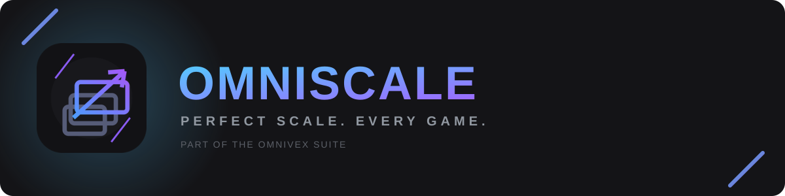

One Windows app for the upscaler runtimes a game ships with: see what's in each
game, swap it for a different version, and put the original back. Per game,
with backups and a record of every write. Part of the [OmniVex](#the-omnivex-suite) suite.

[**Get OmniScale**](#get-omniscale) · [Features](#what-it-does) · [FAQ](docs/FAQ.md) · [Changelog](CHANGELOG.md)

---

## What it does

**Swap the upscaler DLLs.** DLSS, DLSS Frame Generation, DLSS Ray Reconstruction,
AMD FSR 3.1 (DirectX 12 and Vulkan), Intel XeSS up to XeSS 3, XeSS for DirectX 11,
XeSS Frame Generation and XeLL. Every file is checked against its Authenticode
signature before anything is written, the original is kept beside the
replacement, and one button puts it back.

**Read the full version.** `3.10.2.0`, not `3.10` — the whole four-part number,
taken from the file itself rather than guessed from a folder name.

**Manage the mods that add upscalers to games that never had them.**
[OptiScaler](https://github.com/optiscaler/OptiScaler) and
[DLSS Enabler](https://www.nexusmods.com/site/mods/757) share one shim slot,
so the two cannot collide. Installs are tracked file by file and uninstall
restores exactly what was replaced. OptiScaler's `.ini` is editable from a real
settings screen rather than a text editor.

**Update the runtime sets a game already carries.** NVIDIA Streamline (all
eleven `sl.*.dll`, replacing only the ones the game actually ships), the AMD
FidelityFX SDK 2 set that reaches FSR 4, Microsoft DirectStorage and the
Direct3D 12 Agility SDK. Set updates are all-or-nothing with an exact rollback.

**Tell you the truth about FSR 4.** The ML upscaler lives in the Adrenalin
driver, not in any file a game ships, so no tool can switch it on by copying
DLLs. OmniScale reports which FidelityFX shape a game has — the FSR 3.1
monolith or the SDK 2 set that can reach FSR 4 — and whether AMD hardware is
present, and leaves the verdict to the driver instead of claiming one.

**Know what your GPU is.** Dedicated, integrated, or a hybrid laptop — asked of
the WDDM kernel, not guessed from the adapter name.

**Find games nothing else finds.** Steam, GOG, Epic, Ubisoft Connect, Xbox,
Battle.net, EA, plus any folder you point it at.

**Get the disk space back.** NTFS transparent compression (XPRESS or LZX) per
game, in batches, with a re-optimise pass that catches the files a game update
left uncompressed.

**Tell you when a game changed underneath you.** An update that reverted your
swap is detected and offered back, one game at a time or across the whole
library at once.

## See it

<table>
<tr>
<td> <b>Games</b> — 351 games detected across seven launchers, upscaler status on every tile.</td>
<td> <b>Library</b> — every DLSS/FSR/XeSS runtime version OmniScale tracks, FSR 4 included, on its own tab.</td>
</tr>
</table>

## Requirements

| | |
| --- | --- |
| OS | Windows 10 64-bit, build 19041 (20H1) or newer |
| GPU | Any. Some features need a specific vendor's hardware to have any effect. |
| Runtime | None. The build carries its own .NET and Windows App SDK. |

## What this does not do

It does not add DLSS to a game that doesn't support it — that's what
OptiScaler and DLSS Enabler are for, and they come with their own caveats. It
does not promise a newer DLL is a better one: swapping can fix artifacts,
change nothing, or stop a game launching until you press Reset. It never
downloads `nvngx_dlss.dll` on your behalf, because NVIDIA's license doesn't
allow redistributing it.

Do not put OptiScaler or DLSS Enabler into a multiplayer game with
kernel-level anti-cheat. OmniScale warns you and makes you type a
confirmation; the ban risk is still yours.

## Five languages

English, Deutsch, Español, Français and Română — the complete interface, not
just the menus. OmniScale follows your Windows display language automatically.

## Get OmniScale

OmniScale is **donationware**. It is not on any store, and it is not sold
outright — it's supported directly by the people who use it.

Supporters get the packaged, ready-to-install build (installer or portable,
your choice), the complete source matching that exact build, and new releases
as they land.

What you're paying for is convenience and the ongoing work — **not**
exclusivity. OmniScale is GPL-3.0: everyone who receives a build receives the
source with it, along with every freedom that license grants.
[LICENSING.md](LICENSING.md) explains exactly what that means.

If you can't afford to give anything, that's genuinely fine — say so and
you'll get a copy anyway.

## The OmniVex suite

OmniScale is one of a family of tools sharing a design language and a
philosophy — modern, fast, no telemetry:

**OmniTheme** · **OmniBlock** · **OmniCleaner** · **OmniAPO** · **OmniEQ** · **OmniPlay** · **OmniScale** · **OmniShade** · **OmniVisuals** · **OmniGPU** · **OmniVex Gaming Wrappers**

**OmniVex Gaming Wrappers** is four Direct3D compatibility installers — OmniDXVK, OmniDxWrapper, OmniVKD3D and OmniVoodoo2.

## Support and bugs

Found something broken? [Open an issue](../../issues/new/choose) — bug
reports are welcome from everyone, supporter or not.

Security issues: read [SECURITY.md](SECURITY.md) first; please don't open a
public issue for those.

## Licensing at a glance

- **The software** is GPL-3.0. You get the source, and you may study, modify
  and share it.
- **The name, logo and OmniVex identity** are not covered by that license.
  Fork the code freely; give the fork its own name.

Full text: [LICENSING.md](LICENSING.md) · [TRADEMARK.md](TRADEMARK.md) ·
[Third-party notices](THIRD-PARTY-NOTICES.md)

---

Built by <b>OmniVex</b> · A modified version of <a href="https://github.com/beeradmoore/dlss-swapper">DLSS Swapper</a> by Brad Moore

